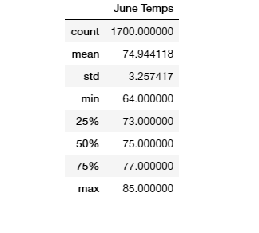
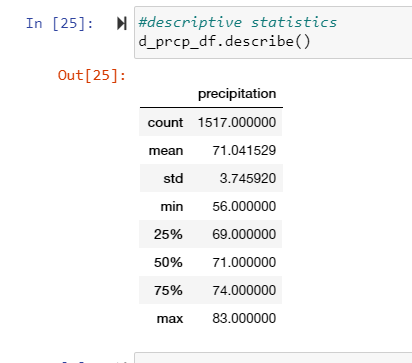
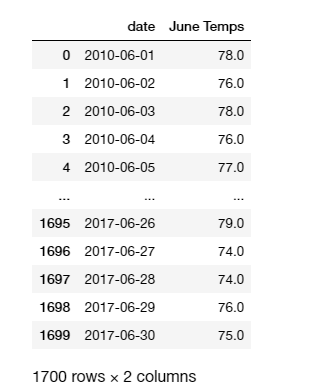
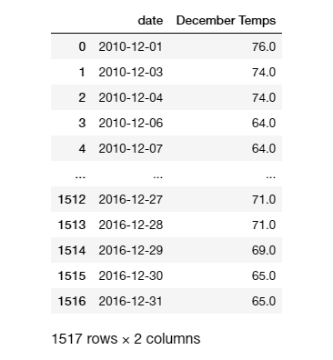

# surfs_up
Using SQL Lite and SQLAlechemy to conduct a weather analysis
Analysis Overview:

We conducted a weather analysis using SQLite, SQLAlchemy, Pandas, and Python,
 the analysis was conducted to  determine whether a year-round surf shop and ice cream business
  will be sustainable in Oahu, HI. 
  
##Results:
June PRECIPITATIONS

December Tempretures

June and December

•The maximum temperature for both December and June are fairly close (83 and 85 respectively)
•Average month of June temperature only about 4 degrees warmer than the one for the month of December (74.9 versus 71).
•Minimum temperature for the month of JUne is 8 degrees higher than for the month of December (64 versus 56)
•
##Summary##

Based on the results, The average temperature for the months of June and December are are almost the same, this is also true for maximum temperature and range, thus having the surf and ice cream shop open year-round is a sound decision which might prove profitable over time. Additional queries could be performed to retrieve and describe the precipitation data to understand the rainfall for the area in these months to ensure green land and sunny days to surf. 
